# ESA Signals Acoustic Modem Project

## Abstract
During this past half-semester in ESA Signals, we spent a considerable amount of time learning about how signals can be utilized and manipulated to convey different types of information. During the first few weeks of class, we were reintroduced to the continuous time and discrete time signals that we had scratched the surface on in QEA, but now we would be learning about the mathematical and applicational reasoning for why signal transforms worked. From there we spent time learning about the different domains that signals existed in and the use cases for each respective domain. Once we had grasped the fundamentals of signals analysis we then began to interact with these signals through operations like multiplication, convolution, and integration. In various case studies ranging from piglets to Kanye West, we gradually built our confidence in operating on different signals. All this work through each in-class problem set and homework assignment would prepare us for our final project: implementing an acoustic modem.

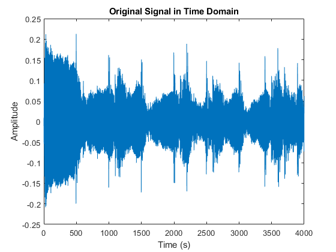 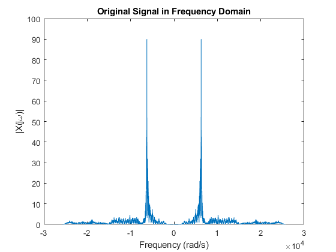
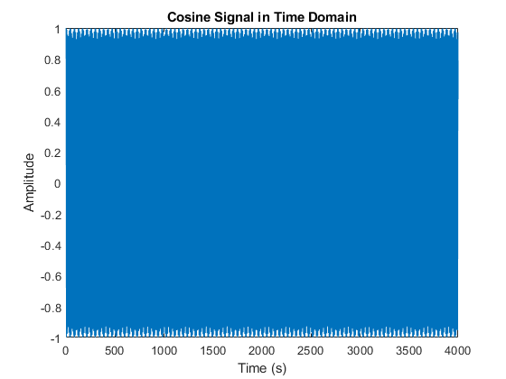 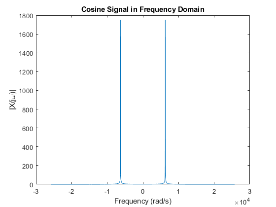
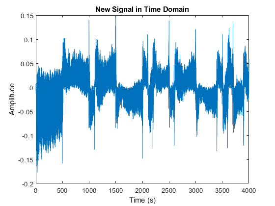 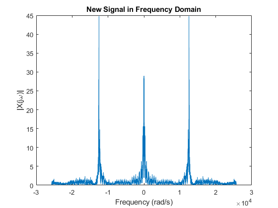
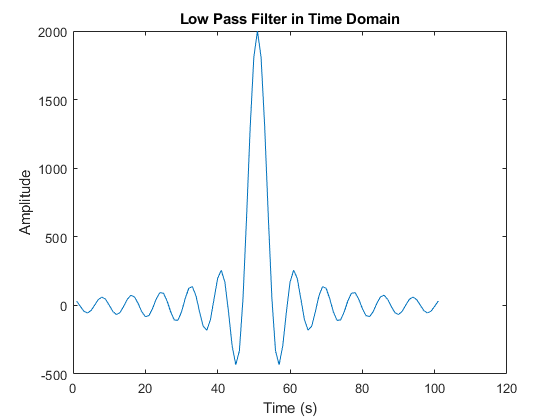 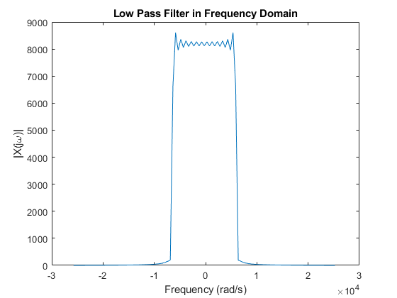
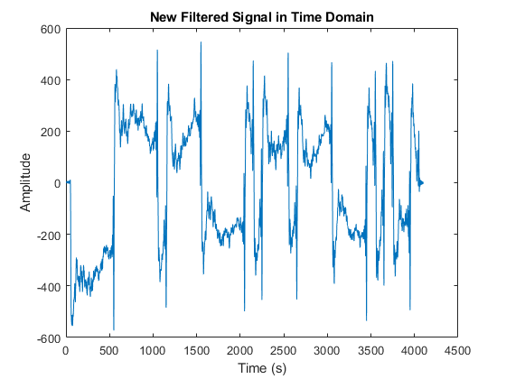 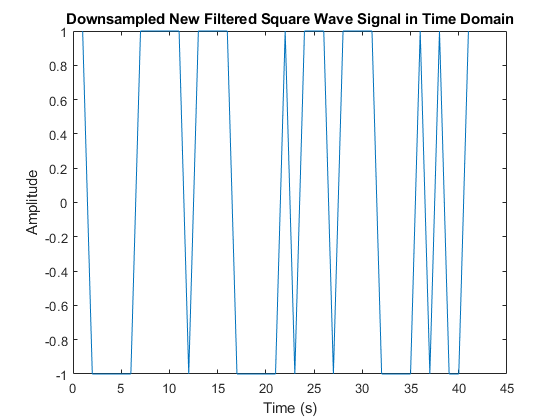
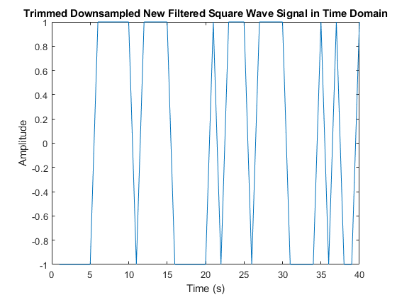 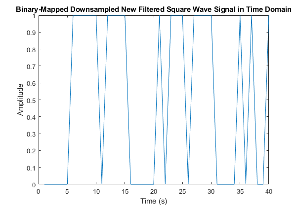

## Deliverables
All documentation can be found in the reports folder.
- MATLAB live script and other code is in `/matlab`.

Link to video: https://www.youtube.com/watch?v=oyXleEOTbJg

*Cheers!*
